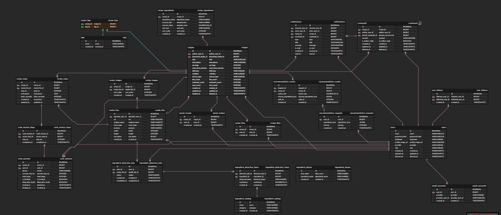

# 🍳 찰칵밥상 (Pictable) — Backend

> 냉장고 속 재료를 찍으면, 만들 수 있는 레시피를 추천해주는 서비스  
> **서비스 URL**: https://pictable.online

---

## 📌 프로젝트 개요

**찰칵밥상**은 자취생을 타깃으로, 현재 가진 재료를 기반으로 요리를 추천해주는 레시피 서비스입니다.  
냉장고 사진을 업로드하면 AI가 재료를 감지하고, 해당 재료로 만들 수 있는 레시피를 매칭해 제공합니다.

| 항목 | 내용 |
|------|------|
| 팀명 | 싸파게티 (SSAFAGETI) |
| 개발 기간 | 2026.04 ~ 2026.06 |
| 배포 URL | https://pictable.online |
| Frontend Repo | https://github.com/SSAFAGETI/pictable-frontend |

---

## 👥 팀원 (Backend)

| 이름 | 역할 |
|------|------|
| 문은서(팀장) | 기획, 프론트 개발 전반 |
| 전민혁 | 백엔드 개발 전반 |

---

## 🛠 기술 스택

### Backend
| 분류 | 기술 |
|------|------|
| Language | Python 3.11.9 |
| Framework | Django 6, Django REST Framework |
| Auth | SimpleJWT, Google OAuth2 |
| AI | Gemini API (gemini-3.1-flash-lite) — 재료 감지 |
| DB | PostgreSQL (AWS RDS db.t4g.micro) |
| Server | AWS EC2 (Ubuntu 24, t3.micro) |
| Web Server | Nginx + Gunicorn |

### Frontend (별도 레포)
Vue.js / Vercel 배포

---

## 🏗 서버 아키텍처
```
Client (Vue.js / Vercel)

│  HTTPS

▼

Nginx (Reverse Proxy)

│

Gunicorn (WSGI)

│

Django REST Framework

│            │

PostgreSQL   Gemini API

(AWS RDS)
```

- EC2: `3.38.26.186` (Elastic IP)
- 프로젝트 루트: `/home/ubuntu/pictable/`
- 가상환경: `.venv/`
- 로그: `/home/ubuntu/pictable/logs/django.log` (RotatingFileHandler)

---

## 📂 앱 구성
pictable/

├── accounts/      # 회원가입, 로그인, JWT, Google OAuth

├── users/         # 프로필, 팔로우

├── recipes/       # 레시피 CRUD, 좋아요, 저장, 댓글

├── medias/        # 이미지 업로드, Gemini 재료 감지

├── feeds/         # 홈 피드 (팔로우 기반)

├── home/          # 레시피 추천 (재료 매칭)

└── notifications/ # 알림

---

## ✨ 주요 기능

### 1. 인증 (accounts)
- 이메일 회원가입 / 로그인 (JWT — Access + Refresh Token)
- Google OAuth2 소셜 로그인

### 2. 미디어 업로드 & 재료 감지 (medias)
- `POST /api/media/upload/` — 이미지 업로드 후 Gemini API로 재료 자동 감지
- `IngredientDetectionJob` → `IngredientDetectionItem` 구조로 감지 결과 저장

### 3. 레시피 추천 (home)
- `POST /api/home/recommendations/` — 재료 목록 입력 → DB 매칭 기반 추천
- 매칭률 기준 정렬: "지금 바로 만들 수 있는" / "1~2가지 부족한" 카테고리 분류

### 4. 레시피 (recipes)
- CRUD, 공개/비공개 설정 (`visibility`)
- 좋아요 / 저장 토글 (`get_or_create` 패턴)
- 댓글 + 대댓글, soft delete (`deleted_at`)
- 커서 기반 페이지네이션 (tiebreaker: `-id`)

### 5. 피드 & 알림
- 팔로우 기반 피드 (`user_follows`)
- 좋아요, 댓글, 팔로우 이벤트 시 알림 생성 (`notifications`)

---

## ⚙️ 로컬 개발 환경 세팅

```bash
git clone https://github.com/SSAFAGETI/pictable-backend.git
cd pictable-backend

python -m venv .venv
source .venv/bin/activate  # Windows: .venv\Scripts\activate

pip install -r requirements.txt

cp .env.example .env
# .env 파일에 DB, JWT, Gemini API 키 등 설정

python manage.py migrate
python manage.py runserver
```

---

## 📄 ERD

> 

---

## 🗄 데이터베이스 주요 테이블

| 테이블 | 설명 |
|--------|------|
| `users` | 사용자 (soft delete) |
| `recipes` | 레시피 (like/comment/save count 캐싱) |
| `recipe_ingredients` | 레시피별 재료 |
| `ingredient_catalog` | 재료 카탈로그 |
| `ingredient_aliases` | 재료 별칭 (매칭 정확도 향상) |
| `ingredient_detection_jobs` | AI 감지 작업 |
| `ingredient_detection_items` | 감지된 재료 목록 |
| `recommendation_requests` | 추천 요청 이력 |
| `recommendation_results` | 추천 결과 (match_rate, 부족 재료) |
| `cook_sessions` | 요리 진행 세션 |
| `media_files` | 업로드 미디어 메타데이터 |

